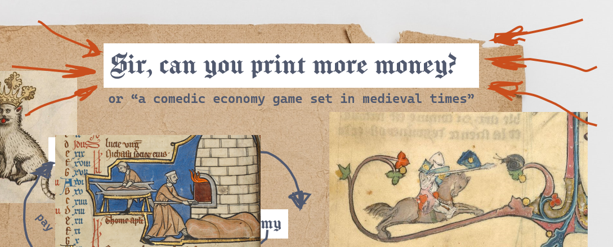
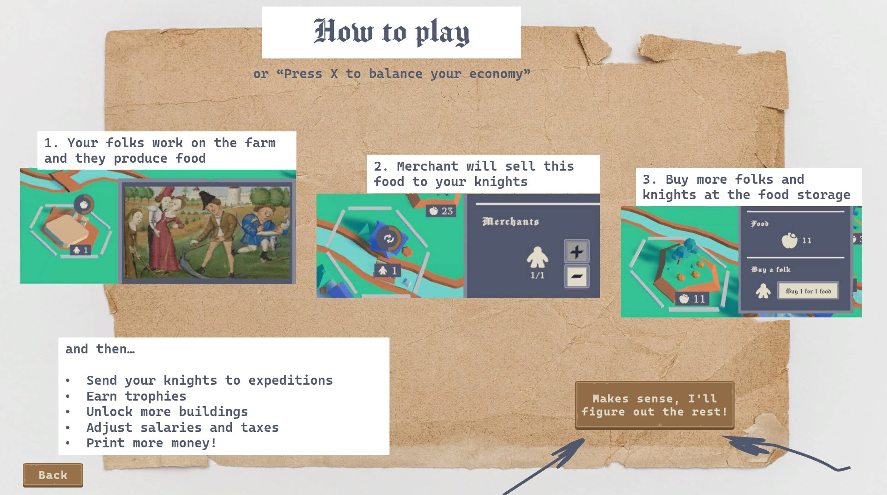
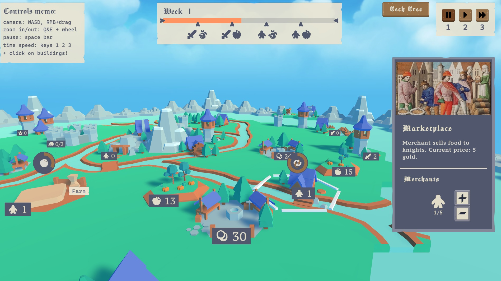

# Sir, can you print more money?
is a comedic economy simulator set in medieval time, where you will balance the life of your knights, farmers and royalty in order to gather a ton of trophies and build a spaceship.
    
 - Manage your economy: set up salaries, taxes and print money!
 - Fight with snails: protect your land from the hoards of snails and earn trophies in expeditions!
 - Invent space travel and send your first spaceship, because this is how strategy games usually end!
 - Official hard mode: drink every time you see a cliché!

The game is made in November 2022 for a GitHub Game Off 2022.

## Acknowledgements

 - [Cascadia Code](https://github.com/microsoft/cascadia-code) is a free and OFL font, made by Microsoft Corporation.
 - [Medieval Theme 02](https://freemusicarchive.org/music/Strobotone/game-and-broadcast-music/medieval-theme-02-1/) is a free and Attribution-NoDerivatives 4.0 International music track by Strobotone .
 - [Hexagon Kit](https://kenney.nl/assets/hexagon-kit) is a free and CC0 object pack, made by [Kenney](www.kenney.nl)
 - [UniRx (Reactive Extensions for Unity)](https://github.com/neuecc/UniRx) is a free and MIT license reimplementation of the .NET Reactive Extensions, made by Yoshifumi Kawai (neuecc)
## Authors

- [@mbkh](https://github.com/mbkh)
- [@dmdspirit](https://github.com/dmdspirit)
